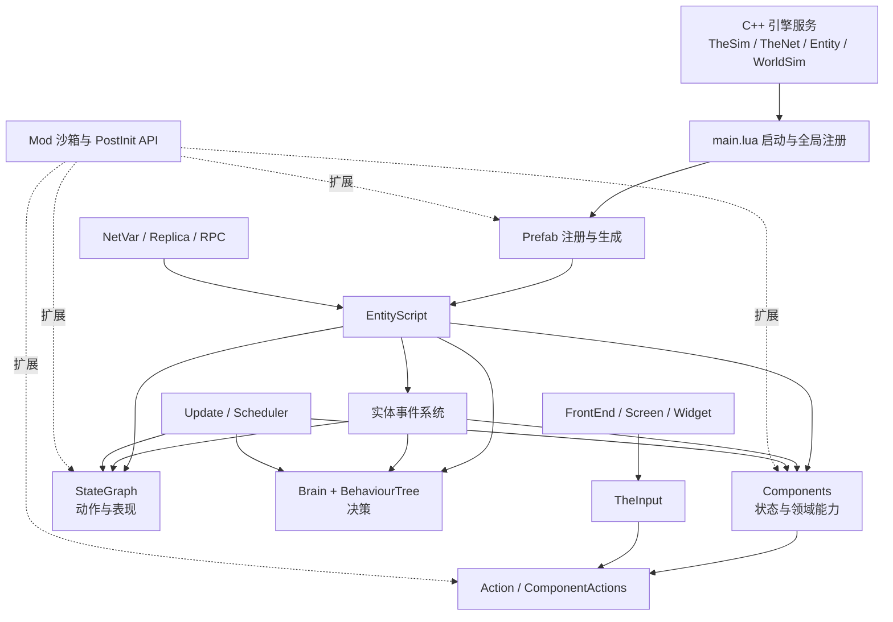
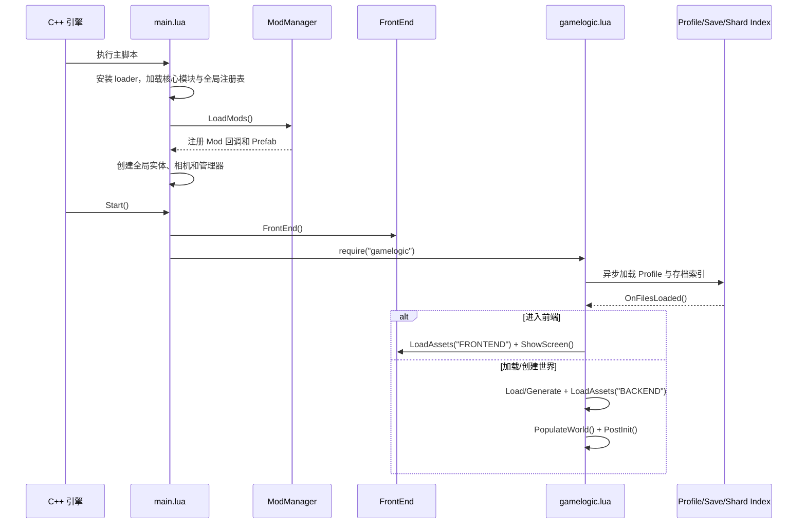
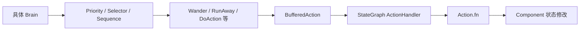
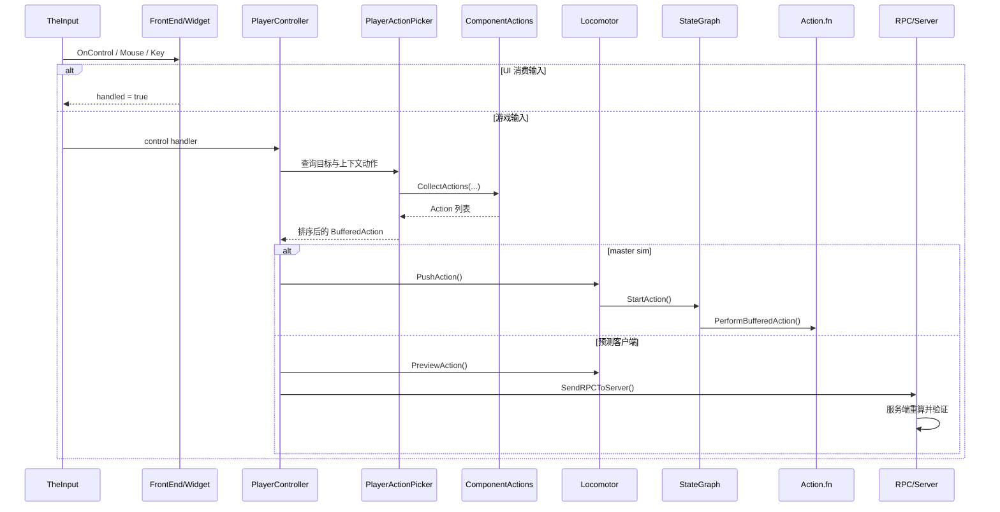
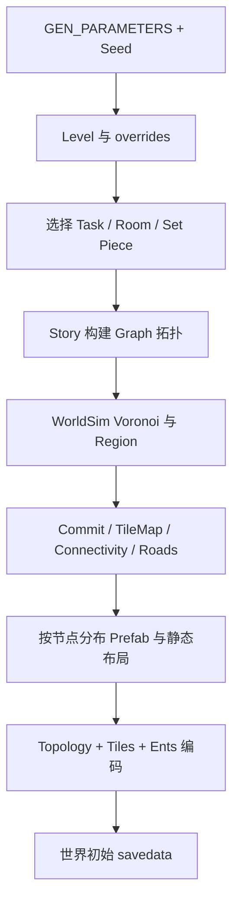

# `scripts-raw` 代码架构分析

> 分析对象：`scripts-raw/` 中的《Don't Starve Together》（DST）原始 Lua 脚本快照
> 分析日期：2026-07-28
> 用途：理解 DST 内部运行机制和 Mod API；该目录是只读参考代码，不应直接修改。

## 1. 执行摘要

`scripts-raw` 不是一个能够脱离游戏引擎独立运行的 Lua 应用，而是 DST C++ 引擎之上的脚本运行时。`TheSim`、`TheNet`、`Entity`、`WorldSim`、渲染、物理和底层网络等能力由引擎注入；Lua 层负责组合游戏对象、编排规则、驱动 AI、处理 UI、保存状态并暴露 Mod 扩展点。

从架构模式看，它是以下几种模式的混合体：

- 以 **Prefab 工厂**定义对象模板；
- 以 **Entity + Component**组合对象能力；
- 以 **事件总线**连接实体、组件、状态机和 AI；
- 以 **StateGraph**驱动有时序的动作与动画；
- 以 **Brain + BehaviourTree**完成 AI 决策；
- 以 **服务端权威 + Replica/NetVar + RPC**支持联机同步和客户端预测；
- 以 **Widget 树 + Screen 栈**组织 UI；
- 以独立的 **WorldGen 运行环境**完成世界生成；
- 以受控环境、PostInit 回调和注册 API 作为 Mod 插件机制。

其最重要的主干关系可以概括为：



## 2. 规模与目录分布

当前快照包含 3,878 个文件，其中 3,864 个 Lua 文件和 14 个非 Lua 文件；Lua 代码约 130.84 万行。非 Lua 文件主要是本地化 PO/POT 文件以及 `controller.vdf`。

| 区域 | Lua 文件数 | Lua 行数 | 占比 | 主要职责 |
|---|---:|---:|---:|---|
| `prefabs/` | 1,519 | 408,849 | 31.2% | 实体模板、资源、组件组装和生命周期回调 |
| 根目录 | 214 | 284,207 | 21.7% | 启动、运行时核心、动作、网络、Mod、存档及大型数据表 |
| `map/` | 444 | 156,660 | 12.0% | 世界生成、任务/房间/布局、拓扑与地形 |
| `stategraphs/` | 249 | 147,930 | 11.3% | 角色和生物的动作状态机 |
| `components/` | 764 | 146,366 | 11.2% | 可组合的游戏能力及 19 个 Replica 组件 |
| `widgets/` | 267 | 75,201 | 5.7% | UI 基础控件和复合控件 |
| `screens/` | 132 | 55,043 | 4.2% | 页面、弹窗、HUD 和前端流程 |
| `brains/` | 184 | 26,099 | 2.0% | 不同生物的行为树装配 |
| `behaviours/` | 28 | 2,620 | 0.2% | 可复用行为树节点 |
| 其他 | 63 | 5,425 | 0.4% | 场景、工具、语言、相机和通用工具 |

静态扫描还观察到：

- 约 4,636 处 `Prefab(...)` 构造；一个 Prefab 文件可以返回多个定义；
- 约 8,135 处 `AddComponent(...)` 调用；
- 244 处 StateGraph 构造；
- 814 处 NetVar 构造；
- 1,521 个 Lua 文件包含 `TheWorld.ismastersim` 分支；
- 5,358 处可静态识别的 `require`，其中 5,276 处可解析到本目录模块。

代码量最大的文件包括 `stategraphs/SGwilson.lua`、`prefabs/skinprefabs.lua`、`strings.lua`、`clothing.lua`、`misc_items.lua`、`tuning.lua` 和 `actions.lua`。这说明系统虽然按领域拆出了大量模块，但玩家状态机、动作注册和集中式数据仍是明显的“热点/巨型模块”。

## 3. 总体分层

### 3.1 引擎桥接层

这一层不完全存在于仓库中，而是由宿主引擎提供：

- `TheSim`：实体、资源、持久化、渲染及运行时服务；
- `TheNet`：服务器、客户端、会话、快照和 RPC；
- `Entity`：底层实体以及 Transform、AnimState、Physics、Network 等原生节点；
- `WorldSim`：世界生成阶段的拓扑、Voronoi、地形烘焙等；
- `TheInputProxy`、`TheSystemService`、`TheGameService` 等平台服务。

Lua 代码大量调用这些对象，但其具体实现不在 `scripts-raw` 中。因此，看到某个 API 只有调用点而没有 Lua 实现时，通常意味着它属于引擎绑定，而不是代码缺失。

### 3.2 基础运行时层

关键文件包括：

- [`main.lua`](scripts-raw/main.lua)：主运行时入口和全局初始化；
- [`mainfunctions.lua`](scripts-raw/mainfunctions.lua)：Prefab、实体、存档和实例切换等核心函数；
- [`class.lua`](scripts-raw/class.lua)：Lua 5.1 风格类、继承和属性 setter；
- [`scheduler.lua`](scripts-raw/scheduler.lua)：协程任务、延时和周期任务；
- [`update.lua`](scripts-raw/update.lua)：帧更新、静态更新和墙钟更新；
- [`entityscript.lua`](scripts-raw/entityscript.lua)：Lua 实体外壳和主要生命周期；
- `constants.lua`、`tuning.lua`、`util.lua`：常量、平衡参数和工具函数。

这一层建立全局注册表和管理器，例如 `Prefabs`、`Ents`、`UpdatingEnts`、`SGManager`、`BrainManager`、`TheWorld`、`ThePlayer` 和 `TheFrontEnd`。这是一个明显的“共享运行时上下文”架构，而不是依赖注入式架构。

### 3.3 领域对象层

- `prefabs/` 描述“一个对象由什么组成”；
- `components/` 描述“对象能做什么、保存什么状态”；
- `actions.lua` 描述“有哪些动作以及如何执行”；
- `componentactions.lua` 描述“某个组件在某种上下文下暴露哪些动作”。

Prefab 本身偏组装，Component 偏能力与状态，Action 偏命令，三者共同构成主要游戏领域模型。

### 3.4 行为编排层

- `stategraphs/`：精确到帧的状态、时间线、动画、动作落点和事件转换；
- `brains/`：为具体生物装配行为树；
- `behaviours/`：可复用的行为树节点；
- `scenarios/`：由 `scenariorunner` 绑定的局部场景脚本。

### 3.5 表现与交互层

- `input.lua`：统一键鼠、手柄、文本和手势输入；
- `components/playercontroller.lua`：把输入转为移动、目标和动作；
- `widgets/`：UI 节点树；
- `screens/`：页面和弹窗；
- `frontend.lua`：Screen 栈、焦点、淡入淡出和全局 UI 更新；
- `cameras/`、`camerashake.lua`：相机。

### 3.6 基础设施与扩展层

- `networkclientrpc.lua`、`networking.lua`、`shardnetworking.lua`：RPC、会话和分片通信；
- `netvars.lua`、`entityreplica.lua`、`*_replica.lua`：状态复制；
- `saveindex.lua`、`shardindex.lua`、`shardsaveindex.lua`：存档索引和分片存档；
- `mods.lua`、`modutil.lua`、`modindex.lua`：Mod 加载、沙箱和扩展 API；
- `worldgen_main.lua` 与 `map/`：独立世界生成环境。

## 4. 启动和实例生命周期

### 4.1 主入口

`main.lua` 的启动过程大致如下：

1. 设置 `package.path` 和自定义 `package.loader`，把模块名映射到游戏或 Mod 脚本；
2. 加载严格模式、日志、配置、数学/向量、Profile 和本地化；
3. 加载 Class、Action、Scheduler、StateGraph、BehaviourTree、Prefab、EntityScript、网络、存档、Mod 等核心模块；
4. 创建 `Prefabs`、`Ents`、各种 Updating 集合以及全局管理器引用；
5. 加载世界 Level/Task/Room/TaskSet/StartLocation 数据；
6. 读取实例参数并异步加载 Mod 索引；
7. `ModSafeStartup()` 加载 Mod、全局 Prefab、成就/配方数据、相机和全局实体；
8. 由引擎回调 `Start()`，创建 `TheFrontEnd` 并加载 `gamelogic.lua`；
9. `gamelogic.lua` 异步加载 Profile、SaveIndex、ShardIndex，再根据 reset action 进入前端、加入服务器、读取世界或触发世界生成。

`Start()` 在 Lua 中定义但没有普通 Lua 调用点，表明它是引擎约定的入口回调。分析这类代码时，不能只依赖 Lua 内部调用图。



### 4.2 世界加载

`gamelogic.lua` 中的 `DoInitGame()` 与 `PopulateWorld()` 是后端世界初始化主链：

- 校验并升级存档；
- 加载后端资源和 Prefab；
- 生成世界 Prefab，并把它设置为 `TheWorld`；
- 恢复地图、道路、实体和组件数据；
- 执行二阶段引用恢复；
- 运行 `ModManager:SimPostInit()` 和 `TheWorld:PostInit()`；
- 恢复玩家快照并通知网络层地图加载完成。

### 4.3 实例重启

前端与游戏世界不是两个进程，而是同一应用内的不同资源/实例状态。`StartNextInstance()` 收集必要状态后调用 `SimReset()`，通过 reset action 决定下一个实例是前端、存档、生成世界还是加入服务器。

## 5. Entity、Prefab 与 Component

### 5.1 EntityScript 是 Lua 对象中心

`CreateEntity()` 先通过 `TheSim:CreateEntity()` 创建底层 Entity，再用 `EntityScript` 包装，并写入全局 `Ents[GUID]`。`EntityScript` 持有：

- 原生节点引用，例如 `Transform`、`AnimState`、`Physics`、`Network`；
- `components` 和 `replica`；
- 标签、事件监听、世界状态监听；
- Brain、StateGraph、BufferedAction；
- pending tasks、children、更新集合和持久化钩子。

它不是纯 ECS 中只有 ID 的 Entity，而是一个带大量行为的 Active Record/Facade。组件化降低了具体 Prefab 的重复，但 `EntityScript` 本身仍是系统枢纽。

### 5.2 Prefab 是注册式工厂

`Prefab(name, fn, assets, deps)` 保存名称、构造函数、资源与依赖。`LoadPrefabFile()` 执行 Lua 文件，收集返回的 Prefab，解析资源并注册给 `TheSim`。`SpawnPrefab()` 由引擎创建对象，最终调用 Prefab 的 `fn`，再执行：

- 指定 Prefab 的 `AddPrefabPostInit`；
- 全局 `AddPrefabPostInitAny`；
- `TheWorld` 的 `entity_spawned` 事件。

典型 Prefab 构造遵循以下顺序：

1. `CreateEntity()`；
2. 添加原生节点，如 Transform、AnimState、SoundEmitter、Network；
3. 配置物理、资源、标签和客户端可见状态；
4. `inst.entity:SetPristine()` 固化初始网络状态；
5. 非 master sim 直接返回客户端实体；
6. master sim 添加权威 Component、StateGraph、Brain 和事件回调；
7. 返回 `inst`。

[`prefabs/rabbit.lua`](scripts-raw/prefabs/rabbit.lua) 是这一模板的代表。它还明确要求 `locomotor` 必须在 StateGraph 之前创建，说明 Prefab 组装存在顺序约束。

### 5.3 Component 是主要能力单元

Component 通常是 `Class(function(self, inst) ...)`，通过 `inst:AddComponent(name)` 动态加载。添加过程会依次：

1. 从 `components/<name>.lua` 加载并缓存类；
2. 尝试建立 Replica；
3. 实例化 Component；
4. 执行 `AddComponentPostInit`；
5. 注册该组件对应的 ComponentAction。

最常被组装的组件包括 `inspectable`、`inventoryitem`、`lootdropper`、`workable`、`stackable`、`combat`、`timer`、`health` 和 `locomotor`。这些组件组成了事实上的领域能力词汇表。

Component 的常见生命周期协议包括：

- `OnUpdate` / `OnStaticUpdate` / `OnWallUpdate`；
- `OnSave` / `OnLoad` / `LoadPostPass`；
- `LongUpdate`；
- `OnRemoveFromEntity`；
- `WatchWorldState` / `StopWatchingWorldState`。

组件接口是约定式的，没有统一抽象基类。新增组件时必须自己遵守这些生命周期约定。

### 5.4 标签是高频索引和轻量协议

标签既用于快速查询，也充当跨模块协议，例如 `player`、`hostile`、`inspectable`、`busy`、`idle`。StateGraph 的一部分状态标签还会同步映射为 Entity 标签。标签性能好、耦合低，但缺少类型约束；拼写错误或生命周期不对称通常只能在运行时暴露。

## 6. 事件、调度与更新模型

### 6.1 实体事件

`EntityScript:ListenForEvent()` 同时记录“谁监听我”和“我监听谁”，便于实体移除时双向清理。`PushEvent()` 的分发顺序是：

1. 普通 Entity 监听器；
2. 当前 StateGraph；
3. 当前 Brain。

事件因此是 Component、Prefab、StateGraph 和 Brain 之间最主要的解耦手段。`PushEventImmediate()` 可绕过 StateGraph 的事件缓冲，但更容易造成重入，需要谨慎使用。

### 6.2 三种更新时间

[`update.lua`](scripts-raw/update.lua) 暴露三类更新：

- `Update(dt)`：模拟时间；依次运行 Scheduler、Component、StateGraph、Brain；
- `StaticUpdate(dt)`：服务器暂停时仍执行的静态任务和组件；
- `WallUpdate(dt)`：真实墙钟时间，处理 RPC 队列、输入、相机、前端和 Wall Component。

每帧主循环的核心顺序为：

```text
Scheduler
  -> Static Component callbacks
  -> Updating Entity Components
  -> SGManager
  -> BrainManager
```

UI Widget 默认把任务切换到 StaticUpdate，因此暂停模拟时 UI 动画和交互仍能继续。

### 6.3 睡眠与休眠

StateGraphManager 和 BrainManager 都把实例分为 updater、tick waiter 和 hibernater。行为节点通过返回下一次需要运行的时间，避免所有 Brain 每帧完整遍历。组件也只有调用 `StartUpdatingComponent()` 后才会进入更新集合。

这是一项关键性能设计：新增逻辑应优先使用事件、延时任务和睡眠，而不是长期无条件 `OnUpdate`。

## 7. StateGraph 与 AI

### 7.1 StateGraph：动作与表现状态机

StateGraph 的基础抽象包括：

- `State`：状态名、标签、进入/退出/更新/超时回调；
- `TimeEvent` / `FrameEvent`：状态内时间线；
- `EventHandler`：事件转换；
- `ActionHandler`：Action 到目标状态的映射；
- `StateGraphInstance`：某实体的当前状态、时间、缓冲事件和 `statemem`；
- `SGManager`：统一调度所有实例。

它适合表示攻击、施法、工作、移动、受击等需要动画时序和精确执行点的行为。Action 通常先把实体送入相应状态，随后某个 FrameEvent 调用 `PerformBufferedAction()`，真正提交领域修改。

玩家有 `SGwilson.lua` 和 `SGwilson_client.lua` 两套大型状态图，体现了服务端权威状态与客户端预测状态的分离。

### 7.2 Brain：决策入口

Brain 负责把某个实体注册到 `BrainManager`，持有行为树 `bt`，并把实体事件转发给 Brain 内部事件处理器。实体休眠或进入 Limbo 时，Brain 会被禁用，醒来时重新实例化。

### 7.3 BehaviourTree：可组合决策

`behaviourtree.lua` 定义 Selector、Sequence、Priority、Condition、Action、Parallel、Event、While 等节点；`behaviours/` 提供 Wander、RunAway、DoAction、ChaseAndAttack 等领域节点；`brains/` 为具体生物装配这些节点。

以 `rabbitbrain.lua` 为例，优先级从恐慌、电网逃避、躲避猎人、回家、觅食到 Wander 依次下降。AI 经常通过 `BufferedAction` 请求动作，最终复用与玩家相同的 Action/StateGraph 执行链。



## 8. 动作系统与输入链路

### 8.1 Action 与 ComponentAction

`actions.lua` 集中定义 Action 元数据和执行函数。Action 包含优先级、距离、鼠标侧、是否即时、适用状态、范围检查、客户端预测回调等。

`componentactions.lua` 按上下文维护动作收集器：

- `SCENE`：对场景实体；
- `USEITEM`：手持/活动物品作用于实体；
- `POINT`：作用于世界坐标；
- `EQUIPPED`：装备物品作用于实体；
- `INVENTORY`：库存内操作；
- `ISVALID`：动作合法性复核。

Entity 在添加 Component 时注册对应的 action component ID。客户端只需同步紧凑的 ID 列表，就能用相同收集表推导交互动作。

### 8.2 BufferedAction 是一次动作请求

`BufferedAction` 把 `doer`、`target`、`action`、`invobject`、坐标、配方、距离及成功/失败回调绑定在一起。它在开始和提交前检查对象有效性、所有权、位置和自定义验证，随后调用 `action.fn(self)`。

### 8.3 输入到动作提交



前端 UI 在 `TheInput:OnControl()` 中拥有优先消费权；只有 UI 未处理的控制事件才继续送往 PlayerController。这是实现虚拟光标、手柄 UI 和按键拦截时必须理解的边界。

## 9. 联机与状态同步

### 9.1 服务端权威

大量 Prefab 在 `SetPristine()` 后通过 `if not TheWorld.ismastersim then return inst end` 分割客户端和服务端逻辑：

- 客户端保留外观、标签、Replica 和预测需要的轻量状态；
- 服务端创建真实 Component、Brain、权威 StateGraph 并修改游戏状态。

客户端发来的动作 RPC 不直接执行客户端指定结果。`networkclientrpc.lua` 会验证参数类型、范围和实体，再调用服务端 PlayerController 重新收集/校验动作。这是重要的安全边界。

### 9.2 NetVar 与 Replica

`netvars.lua` 描述不同位宽的布尔、整数、浮点、字符串、实体和数组类型。约束包括：

- NetVar 必须在服务端和客户端以相同顺序、相同结构声明；
- `set()` 由服务端同步并触发 dirty event；
- `set_local()` 只做本地预测，不同步；
- 数组昂贵，不适合高频变化；
- dirty event 在 Lua Update 之前触发。

`entityreplica.lua` 为可复制 Component 创建 `<name>_replica.lua`。服务端真实 Component 通过 setter 或 classified 实体写入 NetVar；客户端 Replica 对上层提供与服务端 Component 尽量一致的只读查询接口。例如 `health.lua` 保存权威生命值，`health_replica.lua` 读取同步后的 current/max/penalty。

### 9.3 RPC 和分片

- `RPC`：客户端到服务端；
- `CLIENT_RPC`：服务端到指定客户端；
- `SHARD_RPC`：地表、洞穴等世界分片之间；
- Mod 通过 `AddModRPCHandler`、`AddClientModRPCHandler`、`AddShardModRPCHandler` 注册自己的通道。

`shardnetworking.lua` 维护已连接分片、世界设置同步、世界迁移门、投票和跨分片状态。分片是独立 simulation，不应把 `TheWorld` 内的普通实体引用当作跨分片共享对象。

## 10. UI 架构

UI 也复用了 Entity 基础设施：每个 `Widget` 都会创建一个带 `UITransform` 和 `uianim` Component 的实体。主要层级为：

```text
FrontEnd
├── screenroot
│   └── Screen 栈
│       └── Widget 子树
└── overlayroot
    ├── 淡入淡出遮罩
    ├── 标题/帮助文本
    └── 全局覆盖层
```

- `Widget` 管理 children、显示、缩放、焦点、输入和更新；
- `Screen` 继承 Widget，增加页面生命周期和默认焦点；
- `FrontEnd` 管理 Screen 栈、活跃页面、焦点、控制器重复输入、淡入淡出和全局覆盖层；
- `screens/` 依赖 `widgets/` 最为密集，静态扫描得到约 988 条跨目录 require；
- Redux 子目录并不是 Redux 状态管理库，而是游戏新版 UI 目录命名。

手柄焦点不是浏览器式自动布局，而是 Widget 的 `focus_flow` 显式图。新增动态控件后，应同时更新上下左右焦点关系、默认焦点、启用/隐藏状态和 Screen 恢复焦点逻辑。

## 11. 世界生成架构

世界生成使用独立入口 [`worldgen_main.lua`](scripts-raw/worldgen_main.lua)，与正常游戏模拟隔离。该环境把 `GetTime()`、`GetTick()` 等定义为 0，只加载 WorldGen 可用 API，并通过 `ModManager:LoadMods(true)` 加载 `modworldgenmain.lua`。

生成链路为：



核心层级可以理解为：

- Level/TaskSet：一套世界配置与任务集合；
- Task：较大的逻辑区域及解锁关系；
- Room：地形、背景和 Prefab 分布模板；
- Story/Graph：把任务和房间连接成拓扑；
- Static Layout：固定布局和 Set Piece；
- `forest_map.Generate()`：调用 `WorldSim` 烘焙地形、道路、连通性和实体分布。

世界生成最多重试 5 次。生成结果附带 build、seed、level、session 和 save version，然后注入世界实体并按区块序列化。

## 12. 存档模型

存档是服务端职责，`SaveGame()` 在客户端会直接拒绝执行。保存过程为：

1. 遍历 `Ents`，只保存 `persists`、有 Prefab、无父实体且有效的根实体；
2. `EntityScript:GetPersistData()` 依次调用每个 Component 的 `OnSave()`，再调用 Prefab/Entity 的 `OnSave()`；
3. 收集实体间 GUID 引用；
4. 保存地图 tiles、nav、topology、world、world_network、shard_network 和 Mod 记录；
5. 单独序列化玩家 UserSession；
6. 通过 `TheNet:SerializeWorldSession()` 写入世界快照。

加载分两阶段：

- `OnPreLoad`、Component `OnLoad`、Entity `OnLoad` 恢复本体；
- 所有实体创建完后，`LoadPostPass` 根据 `newents` 恢复跨实体引用。

因此，持久化数据不是任意 Lua 对象快照。新增状态必须显式设计 schema，并考虑旧存档缺字段、组件重命名、实体引用和版本升级。

## 13. Mod 扩展机制

### 13.1 加载与沙箱

`mods.lua` 为每个 Mod 创建独立 `env`，暴露基础 Lua 函数、`TUNING`、世界生成常量、`GLOBAL`、`MODROOT` 和扩展 API。`modimport()` 用 `setfenv` 在该环境中执行脚本。

Mod 会先按 priority 和名称排序，再依次执行：

- `modworldgenmain.lua`：世界生成环境；
- `modmain.lua`：正常游戏环境。

### 13.2 推荐扩展点

| 需求 | 推荐 API/位置 |
|---|---|
| 修改现有 Prefab | `AddPrefabPostInit` / `AddPrefabPostInitAny` |
| 修改 Component 实例 | `AddComponentPostInit` |
| 修改 UI Class | `AddClassPostConstruct` / `AddGlobalClassPostConstruct` |
| 新增动作 | `AddAction` + `AddComponentAction` + StateGraph Handler |
| 扩展状态机 | `AddStategraphState/Event/ActionHandler/PostInit` |
| 扩展 AI | `AddBrainPostInit` |
| 新增网络消息 | Mod RPC API |
| 新增世界内容 | `AddLevel/TaskSet/Task/Room/StartLocation/Tile` |
| 新增 Prefab/资源 | `PrefabFiles`、`Assets`、Prefab 定义 |

PostInit 是有意设计的扩展面，应优先于直接替换全局函数或复制原生实现。`AddPrefabPostInitAny` 会对每个生成实体执行，注释也明确提示其中不能放重逻辑。

## 14. 依赖关系特征

静态 `require` 统计中的主要跨目录依赖为：

| 来源 | 目标 | 次数 | 含义 |
|---|---|---:|---|
| `screens` | `widgets` | 988 | Screen 大量组合基础 Widget |
| `brains` | `behaviours` | 748 | Brain 主要负责装配复用行为节点 |
| `prefabs` | 根模块 | 275 | Prefab 依赖公共工厂、数据和工具 |
| `prefabs` | `brains` | 187 | 生物 Prefab 绑定具体 Brain |
| `widgets` | 根模块 | 112 | Widget 依赖输入、常量、缓动和数据 |
| `components` | 根模块 | 68 | Component 依赖共享工具和领域注册表 |

最常被 require 的模块包括 `widgets/widget`、`widgets/text`、`widgets/image`、`stategraphs/commonstates`、`widgets/uianim`、`prefabutil`、`behaviours/wander` 和 `widgets/imagebutton`。

这组数据说明架构的复用中心很清晰：UI 复用 Widget，AI 复用 Behaviour，状态机复用 CommonStates，Prefab 复用 PrefabUtil。但根目录仍承担了过多公共基础设施和大型注册表职责。

静态依赖图并不完整，原因包括动态 `require("components/" .. name)`、Prefab 文件运行时加载、引擎回调、Mod 沙箱和全局符号注入。

## 15. 关键架构约束与风险

### 15.1 全局状态和隐式依赖

大量模块直接读取 `TheWorld`、`ThePlayer`、`TheNet`、`TUNING`、`ACTIONS` 等全局变量。优点是 Mod 和游戏脚本编写直接；缺点是初始化顺序敏感、测试困难、热重载和静态分析不可靠。

### 15.2 客户端/服务端对称性

NetVar 的声明和 Mod ComponentAction ID 必须两端一致。客户端专用逻辑若错误进入服务端，或服务端组件被客户端直接访问，都可能造成反序列化失败、nil 错误或权威状态分叉。

### 15.3 生命周期清理

长期任务、更新组件、世界状态 watcher、跨实体事件和 classified 引用都需要在移除时清理。虽然 EntityScript 会统一清理一部分资源，但 Component 自己创建的引用仍应实现 `OnRemoveFromEntity` 或对称的 Stop/Detach。

### 15.4 性能热点

- 无条件 `OnUpdate` 会进入每帧实体/组件遍历；
- `AddPrefabPostInitAny` 会命中所有 Prefab；
- 高频 `FindEntities`、路径计算和大数组 NetVar 成本高；
- 玩家 StateGraph、Action 表和大型 UI Screen 是高复杂度修改区。

优先选择事件驱动、范围缓存、Scheduler、Brain/SG sleep 和按需更新。

### 15.5 大型集中模块

`SGwilson.lua`、`actions.lua`、`tuning.lua`、`strings.lua` 等是稳定的中心注册表，但改动冲突面大。Mod 应通过扩展 API 增量注册，不应复制整个文件或覆盖全表。

### 15.6 存档与网络都是长期协议

Component `OnSave` 的字段、Action/RPC ID、NetVar 顺序、Prefab 名和标签都可能成为兼容协议。重命名或调整顺序比普通本地重构风险更高。

### 15.7 参考快照与实际游戏版本可能漂移

`scripts-raw` 是本仓库中的一份快照。游戏更新后，函数签名、组件、标签、StateGraph 或网络协议可能发生变化。实现 Mod 时应把这里当作版本相关参考，并在目标游戏版本中做运行验证。

## 16. 对当前 `dst-controller` Mod 的阅读路线

结合本仓库的手柄增强目标，最有价值的原生调用链如下。

### 16.1 手柄与虚拟光标

1. [`input.lua`](scripts-raw/input.lua)：输入事件、UI 优先级、鼠标位置和控制器状态；
2. [`frontend.lua`](scripts-raw/frontend.lua)：Screen/Widget 如何消费控制事件；
3. [`components/playercontroller.lua`](scripts-raw/components/playercontroller.lua)：控制输入、目标选择、预测和 RPC；
4. [`components/playeractionpicker.lua`](scripts-raw/components/playeractionpicker.lua)：鼠标/手柄上下文如何生成动作；
5. [`componentactions.lua`](scripts-raw/componentactions.lua)：实体或物品为什么暴露某个动作。

### 16.2 动作执行

1. [`actions.lua`](scripts-raw/actions.lua)：Action 元数据和执行函数；
2. [`bufferedaction.lua`](scripts-raw/bufferedaction.lua)：动作请求和有效性；
3. [`entityscript.lua`](scripts-raw/entityscript.lua)：Push/Preview/PerformBufferedAction；
4. [`stategraph.lua`](scripts-raw/stategraph.lua)：ActionHandler 和执行时机；
5. `stategraphs/SGwilson*.lua`：玩家动作的服务端/客户端状态。

### 16.3 UI 配置界面

1. [`widgets/widget.lua`](scripts-raw/widgets/widget.lua)：子树、焦点和控制事件；
2. [`widgets/screen.lua`](scripts-raw/widgets/screen.lua)：页面生命周期；
3. [`frontend.lua`](scripts-raw/frontend.lua)：Push/Pop Screen、活跃页面和焦点恢复；
4. `widgets/redux/templates.lua`：新版 UI 常用模板。

### 16.4 地图与寻路

Lua 层能看到 `TheWorld.Map`、`Pathfinder` 和地形 API 的使用方式，但底层寻路、碰撞和 tile 查询的核心实现属于引擎。实现自定义 A* 时，应把原生 Map API 当作地形/通行性数据源，而不能期望在 `map/` 目录找到运行时寻路算法；`map/` 主要负责世界生成。

### 16.5 安全的 Hook 策略

- 优先使用 `AddComponentPostInit`、`AddClassPostConstruct`、`AddPrefabPostInit`；
- 包装原函数时保存原引用，并保持返回值、参数和 master/client 分支；
- 不在 `scripts-raw` 直接修改原文件；
- 不信任客户端动作结果，需通过原生 RPC/Action 流程或服务端验证；
- 对 UI Hook 同时验证键鼠、手柄、暂停、前端和游戏内 Screen；
- 对任何持久化数据加版本和缺省值。

## 17. 总结

`scripts-raw` 的核心不是某个单独模块，而是四条彼此咬合的主链：

1. **Prefab → EntityScript → Component**：构造游戏世界；
2. **Input/AI → BufferedAction → StateGraph → Action.fn**：驱动行为；
3. **Update/Scheduler + Event**：驱动时间和解耦模块；
4. **Server Component → NetVar/Replica → Client Prediction/RPC**：维持联机一致性。

UI、存档、世界生成和 Mod API 都建立在这些主链之上。理解这些边界后，阅读单个 Prefab 或 Component 会容易很多：先判断代码运行在哪一端、由谁构造、通过什么事件或更新触发、最终修改哪个权威 Component，以及是否需要同步和持久化。

---

### 分析方法说明

本文结合目录/行数统计、静态 `require` 扫描以及对启动、实体、组件、状态机、行为树、动作、输入、网络、UI、世界生成、存档和 Mod 加载关键文件的调用链追踪完成。动态 loader、引擎回调和 Mod 注入无法由静态扫描完全覆盖，因此数量统计用于描述结构，不应视为完整运行时调用图。
